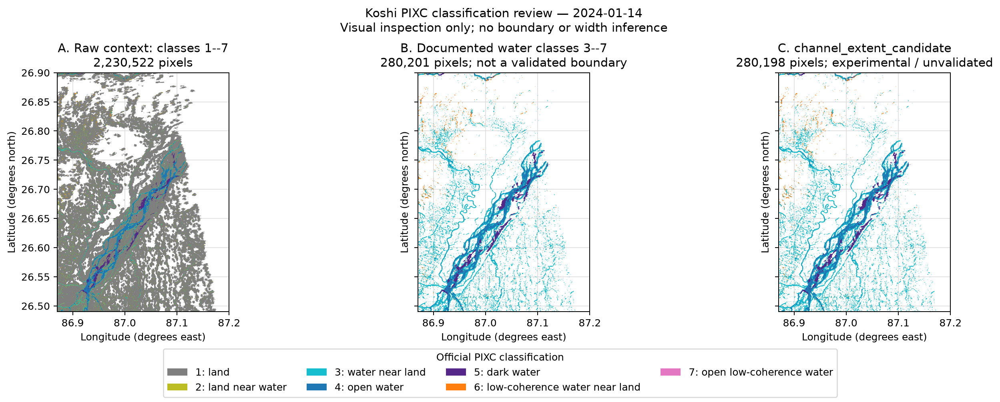

# Phase 4 Koshi PIXC visual review

## Scope

This is a visual diagnostic for the 2024-01-14 SWOT L2 HR PIXC Version D
observation over the project-owner AOI:

```text
(west, south, east, north) = (86.87, 26.49, 87.20, 26.90)
```

It compares raw classification context, the documented water classes, and the
Phase 3 experimental `channel_extent_candidate`. It does not infer a river
boundary, bank, island, branch, or channel width. No real transect was selected.



## Inputs and provenance

The cache-only script opened these two existing local granules without a CMR
search or download:

- `SWOT_L2_HR_PIXC_009_286_107L_20240114T081432_20240114T081443_PGD0_01.nc`
- `SWOT_L2_HR_PIXC_009_286_108L_20240114T081442_20240114T081453_PGD0_01.nc`

As established in Phases 2 and 3, tile 107L has zero exact-AOI points and tile
108L contributes all 2,230,522 plotted raw points. The raw and filtered datasets
retain `source_index` and `source_point_index`; the figure does not change them.

The reproducible command is:

```bash
python examples/koshi_phase4_visual_review.py
```

The script refuses to download missing inputs and stops if the established
pixel counts change.

## What is plotted

| Panel | Selection | Pixels | Scientific status |
|---|---|---:|---|
| A | Raw classes 1–7 | 2,230,522 | Exact-AOI context; no Phase 3 filtering |
| B | `classification in {3, 4, 5, 6, 7}` | 280,201 | Documented water classes; not a validated boundary |
| C | `channel_extent_candidate` | 280,198 | Experimental and unvalidated Phase 3 profile |

Raw classification counts are:

| Class | Official NetCDF meaning | Raw pixels | Candidate pixels |
|---:|---|---:|---:|
| 1 | `land` | 1,824,495 | 0 |
| 2 | `land_near_water` | 125,826 | 0 |
| 3 | `water_near_land` | 105,528 | 105,528 |
| 4 | `open_water` | 131,013 | 131,010 |
| 5 | `dark_water` | 40,167 | 40,167 |
| 6 | `low_coh_water_near_land` | 3,326 | 3,326 |
| 7 | `open_low_coh_water` | 167 | 167 |

The candidate differs from the unfiltered classes 3–7 by only three class-4
pixels rejected as documented in-air conditions. That difference is not
expected to be visually resolvable at whole-AOI scale.

Class 2 remains visible in the raw panel as contextual land-near-water; it is
not treated as candidate water.

## Coordinate extent

All three panels use the full requested EPSG:4326 AOI:

- longitude: 86.87 to 87.20 degrees east
- latitude: 26.49 to 26.90 degrees north

The actual retained point ranges are:

- longitude: 86.87000023936736 to 87.17484127537034
- latitude: 26.490000049899542 to 26.899999359003534

Longitude/latitude axes and a coordinate grid are retained so the owner can
read potential endpoint coordinates. The display aspect compensates locally
for longitude convergence using the mean plotted latitude; no coordinate data
are transformed or replaced for the map.

## Visualization method and performance

The PNG is 2,498 by 1,005 pixels, RGBA, and 750,736 bytes (0.72 MiB). It was
generated with Matplotlib 3.11.1 at 180 dpi.

Every valid plotted point is passed directly as NumPy arrays to one rasterized
Matplotlib `PathCollection` per panel. There is no implicit downsampling and no
construction of millions of GeoPandas point geometries. The fixed raster canvas,
DPI, and compression control this PNG's size. The rasterized artist flag keeps
future vector PDF/SVG exports compact; neither operation changes or aggregates
source values. No online basemap
or network service is used.

Measured local run times on 2026-09-08 were:

| Step | Seconds |
|---|---:|
| Open, exact AOI clip, and combine tiles | 1.152 |
| Apply Phase 3 candidate QC | 0.169 |
| Render all three panels | 7.583 |
| Save PNG | 7.083 |
| Total | 16.050 |

These are one-machine observations, not performance guarantees. Rendering time
depends on Matplotlib, hardware, output resolution, and backend.

## Manual transect input for the next review

Phase 4 does not choose a Koshi transect. After inspecting this figure, provide
the first real transect in EPSG:4326 as:

```text
(lon1, lat1) -> (lon2, lat2)
```

Also choose an explicit sampling half-width, for example 25, 50, or 100 metres.
The API will be:

```python
sample = sample_transect(
    candidate,
    transect=((lon1, lat1), (lon2, lat2)),
    corridor_half_width_m=50.0,
)
```

The function uses a local WGS84-ellipsoid azimuthal-equidistant projection
centered at the user line's geodesic midpoint. It returns discrete pixels with
`station_m` and `distance_to_transect_m` and preserves the original provenance.
Those distances are planar measurements on the projected polyline, not a
blanket guarantee of exact geodesic along-line or offset distances; long or
multi-vertex lines require projection-distortion review. The corridor is a
point-sampling choice with inclusive, round endpoint caps. It is not the
measured river width, and no points are interpolated onto the line.

## Important limitations and owner-review questions

1. Do classes 3, 5, 6, and 7 follow meaningful wetted features at the spatial
   scales relevant to the intended analysis?
2. Are the extensive class-3 features outside the main belt genuine water,
   mixed-edge detections, floodplain features, or artifacts that require
   independent imagery review?
3. Does class 5 improve recognition of dark-water portions of the major
   channels, or create misleading internal patches?
4. Which candidate reach should receive the first manually supplied transect,
   and what corridor half-widths should be compared as a sensitivity test?
5. Which independent image or field observation should be used before any
   pixel selection is treated as a channel boundary?

Dense points overplot at finite PNG resolution, and the map cannot establish
that a visible gap is an island or that a colored trace is a channel. The
candidate remains experimental. **No channel width was calculated.**

## References

- [SWOT L2 HR PIXC Version D collection](https://podaac.jpl.nasa.gov/dataset/SWOT_L2_HR_PIXC_D)
- [SWOT L2 HR PIXC Product Description Document, Revision C](https://archive.podaac.earthdata.nasa.gov/podaac-ops-cumulus-docs/web-misc/swot_mission_docs/pdd/D-56411_SWOT_Product_Description_L2_HR_PIXC_20250224a_RevC_clean_sig_final.pdf)
- [Matplotlib collections and rasterization API](https://matplotlib.org/stable/api/collections_api.html)
- [pyproj Transformer API](https://pyproj4.github.io/pyproj/stable/api/transformer.html)
- [PROJ azimuthal-equidistant projection](https://proj.org/en/stable/operations/projections/aeqd.html)
- [Shapely linear referencing](https://shapely.readthedocs.io/en/stable/linear.html)
